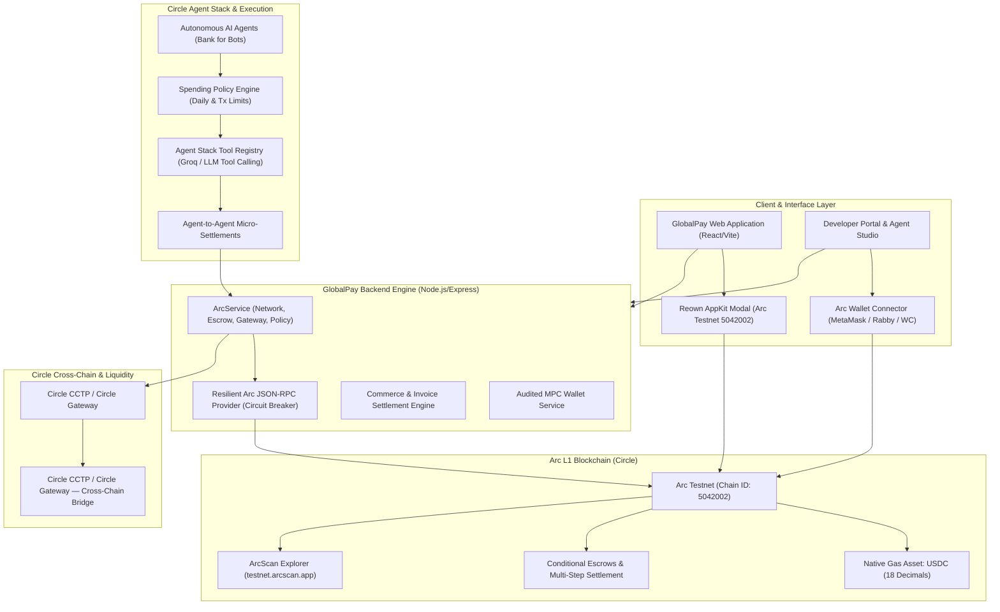

# GlobalPay on Arc L1 — Architecture & Technical Specification

GlobalPay is a programmable, stablecoin-native financial platform and autonomous agent economy built directly on **Arc L1** (Circle's EVM blockchain where **USDC is the native gas and primary settlement token**).

---

## 🏛️ System Architecture Diagram

---

## 🔑 Core Technical Highlights

### 1. Arc L1 Native Gas Token (USDC)
* Unlike conventional EVM chains where gas is paid in ETH or a volatile network token, **Arc uses USDC natively for transaction gas**.
* All fee calculations, balances, transfers, and wallet operations in GlobalPay are denominated directly in USDC with 18 decimals on Arc Testnet (`5042002`).

### 2. Circle Agent Stack for Autonomous AI Economy
* **Headless Wallet Creation**: AI Agents can be minted programmatically with dedicated wallet addresses without human friction.
* **Autonomous Spending Policies**:
  * Real-time policy guardrails enforcing maximum per-transaction spend (e.g. 500 USDC) and daily budgets (e.g. 2500 USDC).
  * Automated budget deduction and risk mitigation before signing on-chain.
* **Agent-to-Agent Nanopayments**:
  * Micro-settlement protocol enabling AI Agents to purchase API compute, OCR extraction, translation, or data synthesis from other agents in sub-cent increments.

### 3. Programmable Escrow & Multi-Step Settlement
* Conditional milestone escrows that lock USDC on Arc and automatically release upon AI or oracle condition verification.
* Enables autonomous commerce contracts between agents and human developers.

### 4. Resilient Arc RPC Architecture
* Multi-endpoint failover connecting to:
  * Primary: `https://rpc.testnet.arc.io`
  * Blockdaemon: `https://rpc.blockdaemon.testnet.arc.io`
  * dRPC: `https://rpc.drpc.testnet.arc.io`
  * QuickNode: `https://rpc.quicknode.testnet.arc.io`
* Automatic circuit breaker preventing endpoint hammering on transient network degradation.

### 5. AppKit & Universal Web3 Onboarding
* Powered by `@reown/appkit` configured with `defineChain` for Arc Testnet (`5042002`) and Arc Mainnet (`5042001`).
* One-click network switching and custom gas token parameters for MetaMask, Rabby, Coinbase Wallet, and Rainbow.
