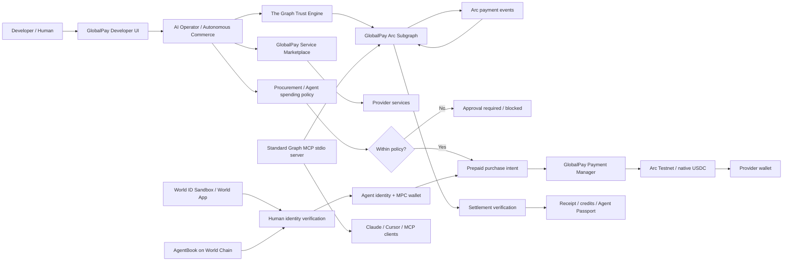

# GlobalPay Architecture

GlobalPay is an autonomous AI-commerce platform. Humans provide identity and policy; AI agents discover providers and make decisions; Arc settles native USDC; The Graph supplies independently indexed settlement evidence.

## System Diagram



## Payment Sequence

```text
1. User gives an agent a goal.
2. GlobalPay discovers active Marketplace services.
3. The Graph Trust Engine analyzes indexed Arc settlements.
4. The agent ranks providers using trust, risk, price, and capability.
5. Procurement policy checks budget, provider, trust, and execution mode.
6. A prepaid purchase intent is created.
7. The consumer agent's MPC wallet signs the Arc payment.
8. GlobalPay Payment Manager settles native USDC to the provider.
9. The Graph indexes the settlement.
10. GlobalPay verifies the indexed payment before declaring settlement complete.
11. The purchase session becomes paid/active and credits/access are recorded.
```

## Responsibility Boundaries

| Layer | Responsibility |
|---|---|
| World ID | Account-level proof that a unique human verified |
| AgentBook | Wallet-specific human-to-agent registration |
| AgentKit gate | AgentBook-backed access and preferred access policy |
| The Graph | Indexed Arc payment evidence, trust, risk, and verification |
| AI Operator | Natural-language intent, provider decision, execution trace |
| Procurement policy | Budget and approval controls before payment |
| Agent MPC wallet | Holds and signs agent USDC transactions |
| Arc | Native USDC settlement and transaction finality |
| Payment Manager | Prepaid settlement contract path and platform/provider split |
| Service Gateway | Provider health, access grants, invocation, and metering |

## Implemented vs Planned Circle Features

### Implemented

- Arc Testnet connectivity.
- Native USDC balance and payment handling.
- MPC-backed agent wallets.
- Prepaid USDC service purchases.
- GlobalPay Payment Manager settlement.
- Spending-policy checks.
- Agent-to-provider service payments.
- ArcScan transaction receipts.
- The Graph settlement verification.

### Explicitly not claimed

- Circle Gateway/CCTP bridging is not currently implemented.
- Paymaster gas abstraction is not currently implemented.
- StableFX is not currently implemented.
- The programmable escrow helper is currently a platform ledger/demo path, not an on-chain escrow contract.
- Arc Mainnet deployment is not currently active; the demo environment uses Arc Testnet chain `5042002`.

The submission should claim the implemented Arc-native agent payment path, not the unavailable integrations.
