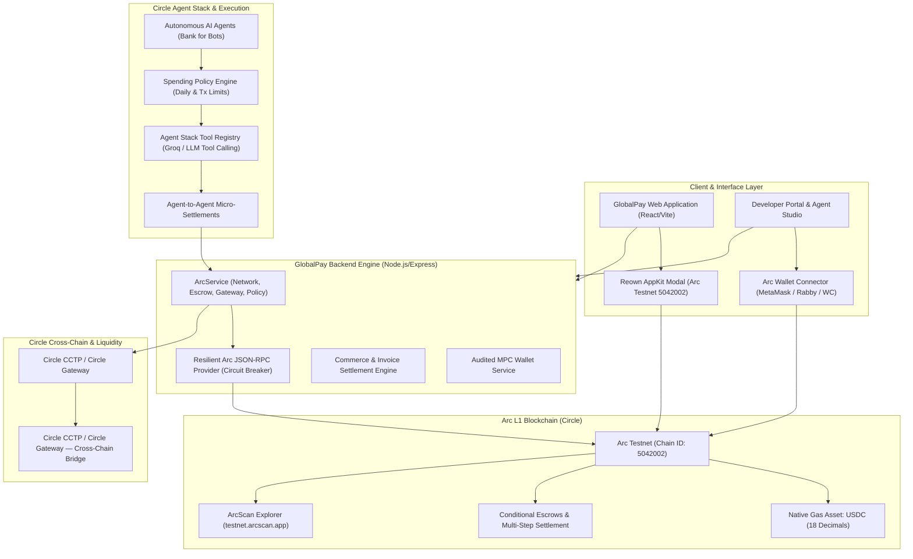

# GlobalPay on Arc L1 — Architecture & Technical Specification

GlobalPay is a programmable, stablecoin-native financial platform and autonomous agent economy built directly on **Arc L1** (Circle's EVM blockchain where **USDC is the native gas and primary settlement token**).

---

## 🏛️ System Architecture Diagram



---

## 🔑 Core Technical Highlights

### 1. Arc L1 Native Gas Token (USDC)
* Unlike conventional EVM chains where gas is paid in ETH or a volatile network token, **Arc uses USDC natively for transaction gas**.
* All fee calculations, balances, transfers, and wallet operations in GlobalPay are denominated directly in USDC with 18 decimals on Arc Testnet (`5042002`).

### 2. Circle Agent Stack for Autonomous AI Economy
* **Headless Wallet Creation**: AI Agents can be minted programmatically with dedicated wallet addresses without human friction.
* **Autonomous Spending Policies**:
  * Real-time policy guardrails enforcing maximum per-transaction spend (e.g. 500 USDC) and daily budgets (e.g. 2500 USDC).
  * Automated budget deduction and risk mitigation before signing on-chain.
* **Agent-to-Agent Nanopayments**:
  * Micro-settlement protocol enabling AI Agents to purchase API compute, OCR extraction, translation, or data synthesis from other agents in sub-cent increments.

### 3. Programmable Escrow & Multi-Step Settlement
* Conditional milestone escrows that lock USDC on Arc and automatically release upon AI or oracle condition verification.
* Enables autonomous commerce contracts between agents and human developers.

### 4. Resilient Arc RPC Architecture
* Multi-endpoint failover connecting to:
  * Primary: `https://rpc.testnet.arc.io`
  * Blockdaemon: `https://rpc.blockdaemon.testnet.arc.io`
  * dRPC: `https://rpc.drpc.testnet.arc.io`
  * QuickNode: `https://rpc.quicknode.testnet.arc.io`
* Automatic circuit breaker preventing endpoint hammering on transient network degradation.

### 5. AppKit & Universal Web3 Onboarding
* Powered by `@reown/appkit` configured with `defineChain` for Arc Testnet (`5042002`) and Arc Mainnet (`5042001`).
* One-click network switching and custom gas token parameters for MetaMask, Rabby, Coinbase Wallet, and Rainbow.

---

## ETHOnline Continuity Sponsor Loop

GlobalPay keeps the four sponsor systems in distinct roles inside one agent-commerce loop:

```text
External AI agent
      │
      ▼
Bazantic Recipes
(machine-readable workflow)
      │
      ▼
GlobalPay Marketplace
      │
      ▼
Trust Engine
(The Graph intelligence + GlobalPay reputation)
      │
      ▼
World AgentKit
(human-authorization layer)
      │
      ▼
Provider decision
      │
      ▼
Arc MPC Wallet
(native USDC settlement)
      │
      ▼
Arc transaction proof
      │
      ▼
The Graph verification
      │
      ▼
Invoice + Usage + Webhook + Reputation
```

## World AgentKit — Identity & Authorization Layer

World AgentKit provides **proof that each AI agent is backed by a real human**. It is an **authorization gate**, not a reputation layer:

```text
World AgentKit: WHO are you?     → Human identity verification
The Graph:      CAN I trust you? → Settlement history + fraud detection
Arc:            CAN I pay you?   → USDC settlement + escrow
```

### How it works

1. **Agent creation**: Anyone can create AI agents and receive wallets — no verification needed
2. **Buying services**: Agents can buy services immediately using Arc wallets
3. **Publishing services**: Requires World AgentKit verification (World ID proof of personhood)
4. **Verification flow**: World App → AgentBook registration → verified status stored
5. **Marketplace badge**: Verified providers display "✓ Human Verified" badge
6. **Authorization gate**: Publishing endpoints return 403 if not verified

### Architecture

```
┌─────────────────────────────────────────────────────────────┐
│                    WORLD AGENTKIT LAYER                     │
│                                                              │
│  worldAgentKitService.js                                    │
│  ├── createAgentBookVerifier()  (canonical World Chain)     │
│  ├── lookupAgentBook(wallet)    → humanId | null            │
│  ├── verifyAgent(agentId)       → { verified, agentBookId } │
│  ├── getBulkVerificationStatus() → Map<agentId, status>    │
│  └── enrichServicesWithVerification() → services + badges   │
│                                                              │
│  API Endpoints:                                              │
│  POST /api/developers/world/verify                          │
│  GET  /api/developers/world/status/:agentId                 │
│  POST /api/developers/world/lookup                          │
│  GET  /api/developers/world/agents                          │
│                                                              │
│  Database columns (ai_agents):                               │
│  world_verified  BOOLEAN                                    │
│  agent_book_id   TEXT                                       │
│  human_backed    BOOLEAN                                    │
│  verification_method TEXT                                   │
│  world_verified_at TIMESTAMPTZ                              │
│  agentbook_tx_hash  TEXT                                    │
└─────────────────────────────────────────────────────────────┘
```

### Trust Score Formula

The Trust Score is derived **exclusively from The Graph settlement history**. World AgentKit verification does NOT influence the score — it is an authorization gate for publishing, not a reputation signal.

```
40% × success rate
+ 15% × customer diversity
+ 15% × track record
+ 15% × recency
+ 15% × consistency
- fraud penalties (self-payments, cancellation streaks, etc.)
```

### Sponsor Responsibilities (Clear Separation)

| Sponsor | Responsibility | Does NOT do |
|---------|---------------|-------------|
| **World AgentKit** | Human identity, authorization to publish | Trust scoring, reputation, provider ranking |
| **The Graph** | Blockchain intelligence, fraud detection, provider selection | Identity verification, payment execution |
| **Arc** | USDC settlement, escrow, payment execution | Trust decisions, identity verification |
| **Bazantic** | Machine-readable workflows, agent interoperability | Trust, identity, or payment decisions |

## AI Assistant — Natural-Language Interface

The AI Assistant is the primary user-facing layer that orchestrates the full loop:

```text
User: "Find the safest OCR provider and buy it"
      │
      ▼
Intent Classifier (14 intents, deterministic regex)
      │
      ├── find_safest → Trust Engine query
      ├── find_risky  → Fraud detection
      ├── find_earners → Volume ranking
      ├── purchase_*  → Full Observe→Decide→Act→Verify
      ├── verify_*    → Graph verification
      └── help        → Capability list
      │
      ▼
Bazantic Recipe Selection
      │
      ▼
Trust Engine (The Graph → 15 metrics → Trust Score)
      │
      ▼
Marketplace Discovery + Provider Matching
      │
      ▼
Arc Settlement (MPC-signed PaymentManager)
      │
      ▼
Graph Verification (PaymentCreated → PaymentReleased)
      │
      ▼
Invoice + Credits + Reputation Update
      │
      ▼
Structured Response with Reasoning
```

See [docs/AI_ASSISTANT.md](docs/AI_ASSISTANT.md) for full architecture, sequence diagrams, and demo flow.

### Observe → Decide → Act → Verify → Improve

1. **Observe:** The Trust Engine reads provider settlement activity from The Graph when configured and combines it with existing GlobalPay reputation and usage records.
2. **Decide:** Existing marketplace recommendations rank providers using the Trust Engine score before a purchase intent is created.
3. **Act:** Existing MPC wallet and Arc settlement code execute the USDC payment.
4. **Verify:** The Trust Engine can query the Graph provider for the resulting transaction hash after settlement.
5. **Improve:** GlobalPay refreshes provider reputation after settlement, so the next recommendation reflects the outcome.

### Sponsor Ownership

| Layer | Owner | Existing GlobalPay boundary |
|---|---|---|
| Agent interoperability | Bazantic Recipes | `bazantic-recipes/`, existing `/api/developers/*` APIs |
| Decision intelligence | The Graph + Trust Engine | `graphIntelligenceService.js`, `/api/developers/graph/*` |
| Identity & authorization | World AgentKit | `worldAgentKitService.js`, `/api/developers/world/*` |
| Financial execution | Arc | MPC wallet service, Arc RPC, prepaid confirmation |
| Commerce state | GlobalPay | invoices, usage reports, webhooks, reputation |
